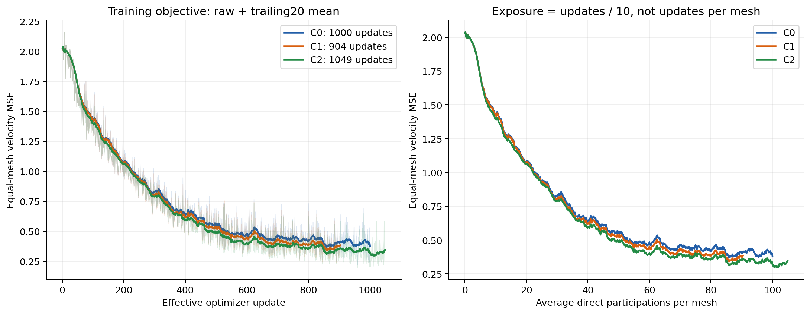
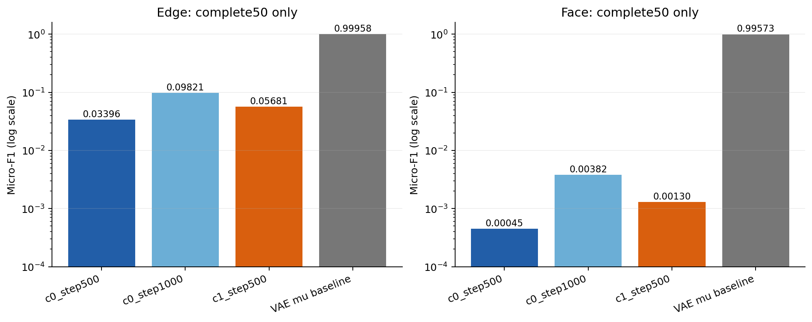

# Topology Flow：固定50条结果归档（2026-10-08）

本目录只收录 **Topology Flow**。冻结OwnAE-v2/VAE仅作为接口、来源和同50条重建参照；`_vertex_reference.py`是Flow实现依赖，不包含独立Vertex训练实验。老师源码、老师原始数据包及独立AE成果由其他任务维护。本次仅只读取证、CPU汇总/渲染、上传；没有启动训练、GPU评价或修改模型。

## 先看结果

| 组 | 实际有效更新 | 已完成全50评价 | Edge / 实际Face micro-F1 | 联合严格 |
|---|---:|---|---|---|
| C0 | 1000 | @500 | 0.033958 / 0.000450 | 0/50 |
| C0 | 1000 | @1000 | 0.098207 / 0.003818 | 0/50 |
| C1 Fourier | 904 | @500 | 0.056811 / 0.001302 | 0/50 |
| C1 Fourier | 904 | @904仅41条 | 不给全50分数 | 未完成 |
| C2 teacher-style | 1049 | @500仅39条；@1000/@1049未评价 | 不给全50分数、不排名 | 未完成 |
| 冻结VAE μ重建参照 | 不属于Flow更新 | 50条重建 | 0.999581 / 0.995732 | 15/50 |

**C1在相同500步时总体优于C0，但所有完整Flow评价仍远离VAE回解水平。** C2的MSE下降不能代替缺失的生成评价。8000是每组授权更新上限，实际受到共4 GPU小时限制；C2评价账本未闭合且当前容器已经不同，退出原因未确认。详见[结果、困难mesh比较与局限](reports/CONCLUSIONS_zh.md)。

## 文件入口

- [结构、论文差异、实际配方](reports/STRUCTURE_AND_SCOPE_zh.md)
- [指标说明与完整性验证](reports/METRICS_README.md)、[逐UID总表](reports/per_uid_all_checkpoints.csv)、[完整50条汇总](reports/full50_aggregates.csv)
- [同UID结构变化](reports/common_uid_pairwise.csv)、[大mesh分组比较](reports/common_uid_group_comparisons.csv)
- [C0实际运行代码](snapshot/c0/code)、[C1/C2实际运行代码](snapshot/candidates/code)、[配置与固定50名单](snapshot/candidates/configs)
- [完整恢复权重：服务器路径、大小与复算SHA](audit/SERVER_WEIGHT_MANIFEST.json)、[冻结VAE依赖](audit/frozen_vae_dependency.json)
- [全量服务器文件来源与SHA](audit/SOURCE_MANIFEST.json)、[本地历史材料清单](audit/LOCAL_SOURCE_MANIFEST.json)、[文本凭据扫描](audit/remote_security_scan.json)
- [运行环境与旧PID检查](audit/server_runtime_snapshot.json)、[代码与报告逐文件SHA](FILE_MANIFEST.json)
- [研究报告](research)：为此前的结构调研，实验最终状态以本页和本次snapshot为准。研究材料包含对老师机制的分析，不重复上传老师源码包。

## Release：完整结果数组与可视化

专属下载页：[topology-flow-evidence-2026-10-08](https://github.com/leoguohr/nexus/releases/tag/topology-flow-evidence-2026-10-08)。本任务使用独立分支，未改`main`，未修改其他任务的`evidence-2026-10-08` Release、标签或资产。

| 资产 | 内容 |
|---|---|
| `TopologyFlow_report_bundle_20261008.zip` | 本目录的代码、配置、日志、逐UID指标、结论、来源核验及小型报告图；首先下载这一包 |
| `TopologyFlow_c0_20261008.tar.gz` | C0真实500/1000生成，包含原始latent/解码数组、全部GT/预测OBJ、日志及运行代码 |
| `TopologyFlow_candidates_20261008.tar.gz` | C1/C2所有现存完整与部分结果、数组/OBJ、日志、性能校准、完整恢复点索引 |
| `TopologyFlow_fixed50_20261008.tar.gz` | 唯一固定50的数据/坐标/顶点顺序/GT来源、真实点云XYZ法向、μ/logvar缓存、标准化及μ/后验噪声VAE基线 |
| `TopologyFlow_visualizations_20261008.tar.gz` | 40张GT/生成对照页；每个已保存条件显示全部50 UID，未完成者明确标空；不修复、不截断几何 |
| `TopologyFlow_initial_history_20261008.tar.gz` | 最初执行代码、审计和历史状态；不得覆盖最终状态 |
| `TopologyFlow_local_research_and_history_20261008.zip` | 本地结构研究、CPU测试、适配与启动证据；已排除旧“未评价”占位图和重复大包 |

资产大小/SHA见[ASSET_MANIFEST.json](ASSET_MANIFEST.json)与[RELEASE_SHA256SUMS.txt](RELEASE_SHA256SUMS.txt)。上传完成后，Release另附`UPLOAD_VERIFICATION.json`，记录GitHub返回的每项大小与`sha256`，逐项对照源文件。清单和验证文件不做递归自哈希。

恢复完整本地证据时，先解压report bundle，再将C0/candidates包解压到本目录的`snapshot/`；fixed50与initial_history包去掉首层目录后解压到`snapshot/initial/`。visualizations包解压到本目录即可得到`visuals/`。解压后可用SOURCE_MANIFEST记录的资产内路径与SHA核验；路径映射见ASSET_MANIFEST。

约28GB/份的model/AdamW/RNG/数据游标恢复权重按原授权留在持久服务器，8份实际文件共约224.06GB，已逐份重新计算SHA并与原索引匹配；其中历史C0@500有重复副本。它们未上传为Git对象或Release分片。冻结VAE权重也只提供经过复算的来源清单。

## 固定接口与解释边界

固定50条，共52,820顶点、154,978条Edge、102,890个Face；`001825`沿用用户批准的1277点原拓扑。使用GT顶点与原8192点XYZ/法向条件。VAE为OwnAE-v2 step36220，NativeTopologyAE/B_v2_teacher_blocks，latent512；未载入老师权重。

真实生成均由独立高斯t=0经本地Euler50至t=1，再逆标准化进入冻结Decoder。Face来自预测Edge图完整triangle候选；候选外GT计FN。训练MSE、VAE回解、Flow真实生成分别报告。没有Vertex预测顶点串联成功证据，没有严格50/50结果，不以部分UID或不同checkpoint拼接成功。

已过期的campaign和预算文件是执行证据，不能直接重新运行。后续训练/评价需要新授权预算、复核不可变checkpoint SHA并继承完整状态；本归档不自动续训，也没有启用TF32/BF16/Flash替换原FP32/MATH设置。
